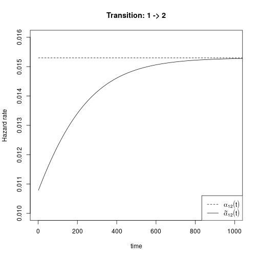
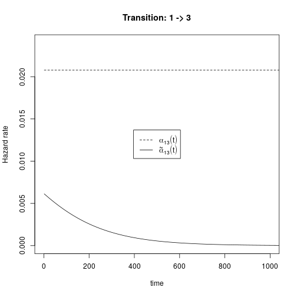
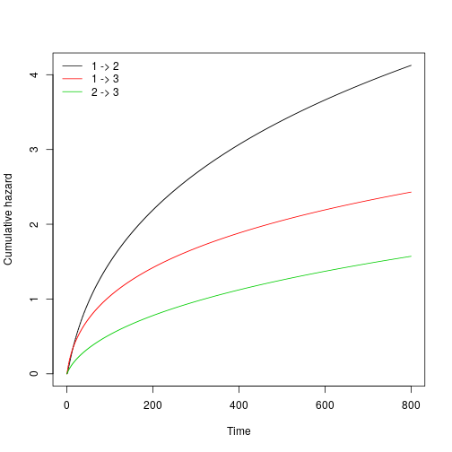
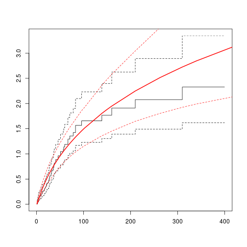
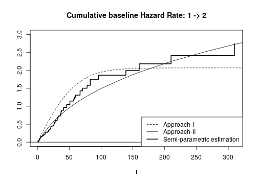
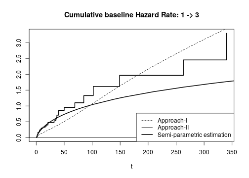
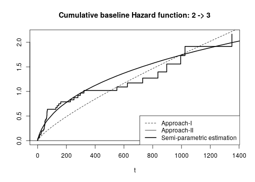

## Data and R package 


```r
library("p3state.msm")
library("mstate")
library(SemiMarkov)
library(flexsurv)
library(xtable)
data("heart2")
head(heart2)
```

```
  times1 delta times2 time status        age      year surgery
1     50     0      0   50      1 -17.155373 0.1232033       0
2      6     0      0    6      1   3.835729 0.2546201       0
3      1     1     15   16      1   6.297057 0.2655715       0
4     36     1      3   39      1  -7.737166 0.4900753       0
5     18     0      0   18      1 -27.214237 0.6078029       0
6      3     0      0    3      1   6.595483 0.7008898       0
```

### Illness-Death Model 


#### Transition matrix for using mstate package


```r
tmat <- transMat(x = list(c(2, 3), c(3),c()), names = c("1", "2", "3"))
tmat
```

```
    to
from  1  2  3
   1 NA  1  2
   2 NA NA  3
   3 NA NA NA
```

#### Reproduce results from p3state.msm with a Semi Parametric approach 


```r
obj1.p3state <- p3state(heart2, formula = ~ surgery+age+year)
summary(obj1.p3state, model = "CSMM")
```

```
Illness-death model 
 
Number of individuals experiencing the intermediate event:  69 
Number of events for the direct transition from state 1 to state 3:  30 
Number of individuals remaining in state 1:  4 
Number of events on transition from state 2:  45 
Number of censored observations on transition from state 2:  24 
 
 
********************* COX SEMI-MARKOV MODEL ********************* 
 
    *************** FROM STATE 1 TO STATE 3 **************** 
 
n=  103 
               coef exp(coef)   se(coef)          z   Pr(>|z|)
surgery -0.22875449 0.7955238 0.63608541 -0.3596286 0.71912491
age      0.01978539 1.0199824 0.01807908  1.0943806 0.27378810
year    -0.28331015 0.7532861 0.11096315 -2.5531913 0.01067409
  
        exp(coef) exp(-coef) lower .95 upper .95
surgery 0.7955238  1.2570334 0.2286737 2.7675156
age     1.0199824  0.9804091 0.9844729 1.0567728
year    0.7532861  1.3275168 0.6060493 0.9362934
  
Likelihood ratio test=  8.623363 on  3  df, p= 0.03474115 
  
-2*Log-likelihood= 214.9848 

    *************** FROM STATE 1 TO STATE 2 **************** 
 
n=  103 
                coef exp(coef)   se(coef)          z   Pr(>|z|)
surgery 0.0473360792  1.048474 0.31524102 0.15015838 0.88063966
age     0.0311147186  1.031604 0.01398119 2.22546929 0.02604975
year    0.0007505999  1.000751 0.06948591 0.01080219 0.99138127
  
        exp(coef) exp(-coef) lower .95 upper .95
surgery  1.048474  0.9537668 0.5652286  1.944874
age      1.031604  0.9693644 1.0037190  1.060263
year     1.000751  0.9992497 0.8733322  1.146760
  
Likelihood ratio test=  5.768582 on  3  df, p= 0.1234284 
  
-2*Log-likelihood= 509.5638 

    *************** FROM STATE 2 TO STATE 3 **************** 
 
n=  69 
               coef exp(coef)   se(coef)          z   Pr(>|z|)
surgery -0.85122211 0.4268929 0.45223331 -1.8822632 0.05980029
age      0.04772024 1.0488772 0.02166619  2.2025217 0.02762848
year    -0.03430307 0.9662786 0.09661041 -0.3550659 0.72254021
  
        exp(coef) exp(-coef) lower .95 upper .95
surgery 0.4268929  2.3425079 0.1759451  1.035764
age     1.0488772  0.9534005 1.0052691  1.094377
year    0.9662786  1.0348982 0.7995901  1.167716
  
Likelihood ratio test=  11.55842 on  3  df, p= 0.009059561 
  
-2*Log-likelihood= 310.9225 

Checking the Markov assumption: 
Testing if the time spent in state 1 (start) is important on transition from state 2 to state 3 

              coef exp(coef)    se(coef)         z   Pr(>|z|)
start -0.009392569 0.9906514 0.005340591 -1.758713 0.07862619

Warning: the p-value is  0.07862619 
```

```r
obj1.p3state$csmm23
```

```
Call:
coxph(formula = covar, data = coxdata, subset = (coxdata[, 5] == 
    1), na.action = na.exclude)

            coef exp(coef) se(coef)      z      p
surgery -0.85122   0.42689  0.45223 -1.882 0.0598
age      0.04772   1.04888  0.02167  2.203 0.0276
year    -0.03430   0.96628  0.09661 -0.355 0.7225

Likelihood ratio test=11.56  on 3 df, p=0.00906
n= 69, number of events= 45 
```

```r
obj1.p3state$msm13
```

```
Call:
coxph(formula = covar, data = coxdata, subset = (coxdata[, 5] == 
    0), na.action = na.exclude)

            coef exp(coef) se(coef)      z      p
surgery -0.22875   0.79552  0.63609 -0.360 0.7191
age      0.01979   1.01998  0.01808  1.094 0.2738
year    -0.28331   0.75329  0.11096 -2.553 0.0107

Likelihood ratio test=8.62  on 3 df, p=0.03474
n= 103, number of events= 30 
```

```r
obj1.p3state$msm12
```

```
Call:
coxph(formula = covar, data = coxdata, subset = (coxdata[, 5] == 
    0), na.action = na.exclude)

             coef exp(coef)  se(coef)     z     p
surgery 0.0473361 1.0484743 0.3152410 0.150 0.881
age     0.0311147 1.0316038 0.0139812 2.225 0.026
year    0.0007506 1.0007509 0.0694859 0.011 0.991

Likelihood ratio test=5.77  on 3 df, p=0.1234
n= 103, number of events= 69 
```

Some conclusions:

- tranistion 1-2:  age significant
- transition 1-3:  year significant
- transition 2-3: surgery and age significant


# Biometrics paper analysis

To use the R package _SemiMarkov_, we first have to put the data in a long data format.

## Long data format using mstate package


```r
msebmt <- msprep(data = heart2, trans = tmat, time = c(NA, "times1", "time"), status = c(NA, "delta", "status"), keep = c("age", "year", "surgery"))
head(msebmt)
```

```
An object of class 'msdata'

Data:
  id from to trans Tstart Tstop time status        age      year surgery
1  1    1  2     1      0    50   50      0 -17.155373 0.1232033       0
2  1    1  3     2      0    50   50      1 -17.155373 0.1232033       0
3  2    1  2     1      0     6    6      0   3.835729 0.2546201       0
4  2    1  3     2      0     6    6      1   3.835729 0.2546201       0
5  3    1  2     1      0     1    1      1   6.297057 0.2655715       0
6  3    1  3     2      0     1    1      0   6.297057 0.2655715       0
```


## Using Approach-I: sojourn distribution using SemiMarkov package


```r
states <- c("1", "2", "3")
data.semi <- msebmt[which(msebmt$status==1|((msebmt$time<msebmt$Tstop)&(msebmt$status==0))),c(1,2,3,7,8,9,10,11)]
data.semi$to[which(data.semi$status==0)] <- data.semi$from[which(data.semi$status==0)]
head(data.semi)
```

```
An object of class 'msdata'

Data:
   id from to time status        age      year surgery
2   1    1  3   50      1 -17.155373 0.1232033       0
4   2    1  3    6      1   3.835729 0.2546201       0
5   3    1  2    1      1   6.297057 0.2655715       0
7   3    2  3   15      1   6.297057 0.2655715       0
8   4    1  2   36      1  -7.737166 0.4900753       0
10  4    2  3    3      1  -7.737166 0.4900753       0
```

Need more processing step to get all the data in long format.

## Check data processing


```r
data.semi$id[which(data.semi$status==0)] -> set.ind.semi
which(heart2$status==0) -> set.heart
missdata.ind <- setdiff(set.heart,set.ind.semi)

data.to.add <- msebmt[which(msebmt$id%in%missdata.ind),]
data.to.add$to <- 1
data.semi <- rbind(data.semi,data.to.add[c(1,3,5,7),c(1,2,3,7,8,9,10,11)])

colnames(data.semi) <- c("id","state.h","state.j","time","status","age","year","surgery")

head(msebmt)
```

```
An object of class 'msdata'

Data:
  id from to trans Tstart Tstop time status        age      year surgery
1  1    1  2     1      0    50   50      0 -17.155373 0.1232033       0
2  1    1  3     2      0    50   50      1 -17.155373 0.1232033       0
3  2    1  2     1      0     6    6      0   3.835729 0.2546201       0
4  2    1  3     2      0     6    6      1   3.835729 0.2546201       0
5  3    1  2     1      0     1    1      1   6.297057 0.2655715       0
6  3    1  3     2      0     1    1      0   6.297057 0.2655715       0
```

```r
head(data.semi)
```

```
An object of class 'msdata'

Data:
   id state.h state.j time status        age      year surgery
2   1       1       3   50      1 -17.155373 0.1232033       0
4   2       1       3    6      1   3.835729 0.2546201       0
5   3       1       2    1      1   6.297057 0.2655715       0
7   3       2       3   15      1   6.297057 0.2655715       0
8   4       1       2   36      1  -7.737166 0.4900753       0
10  4       2       3    3      1  -7.737166 0.4900753       0
```

```r
data.semi <- as.data.frame(data.semi)
table.state(data.semi)
```

```
$table.state
  1  2  3
1 4 69 30
2 0 24 45
3 0  0  0

$Ncens
[1] 28
```

All is going well and we can now use the _SemiMarkov_ package for modelling the sojourn times.


## A simple model: Exponential distribution without covariate effect 

An exponential distribution on sojourn does not provide exponential hazard rate for the intensity function.


### model fit:  Exponential


```r
mtrans <- matrix(FALSE, nrow = 3, ncol = 3)
mtrans[1, 2:3] <- c("E", "E")
mtrans[2, c(3)] <- c("E")
fit <- semiMarkov(data = data.semi, states = states, mtrans = mtrans)
```

```

Iter: 1 fn: 861.0347	 Pars:   65.36277  48.13008 264.06141   0.70306
Iter: 2 fn: 861.0347	 Pars:   65.36412  48.12954 264.06088   0.70305
solnp--> Completed in 2 iterations
```

```r
fit$table.dist
```

```
$Sigma
  Type Index Transition Estimation    SD Lower_CI Upper_CI Wald_H0 Wald_test p_value
1 dist     1     1 -> 2     65.364  7.98    49.72    81.01    1.00     65.04 <0.0001
2 dist     2     1 -> 3      48.13  9.31    29.87    66.38    1.00     25.60 <0.0001
3 dist     3     2 -> 3    264.061 39.25   187.14   340.98    1.00     44.93 <0.0001
```

```r
fit$table.proba
```

```
   Type Index Transition Probability     SD Lower_CI Upper_CI Wald_H0 Wald_test p_value
1 proba     1     1 -> 2   0.7030471   0.05        -        -       -         -       -
2 proba     -     1 -> 3   0.2969529 0.0021        -        -       -         -       -
3 proba     -     2 -> 3   1.0000000      -        -        -       -         -       -
```

```r
AIC.sojourn <- 2*(fit$minus2loglik+dim(fit$param.init)[1])
AIC.sojourn
```

```
[1] 1730.069
```

```r
res.AIC.sojourn <- NULL
res.NP.sojourn <- NULL

res.AIC.sojourn <- c(res.AIC.sojourn,AIC.sojourn)
res.NP.sojourn <- c(res.NP.sojourn,dim(fit$param.init)[1])
res.data.frame <- NULL
res.coef <- matrix(NA,ncol=7,nrow=3)
res.coef[,7]<-fit$table.proba$Probability
res.coef[,c(7)] <- signif(res.coef[,c(7)],digits = 3)
colnames(res.coef) <- c("surgery","sd","age","sd","year","sd","pij")
model.name <- "Baseline Exp"
res.data.frame <- rbind(res.data.frame,data.frame(Model=rep(model.name,3),Transition=c("1-->2","1-->3","2-->3"),Distribution=rep("Exp",3),res.coef))
```

### Hazard rate of sojourn times and Hazard rate of the semi-Markov process


```r
intensity.baseline <- hazard(fit,type="lambda")
hazard.baseline <- hazard(fit)

plot(intensity.baseline$vector[,1]~intensity.baseline$Time,type="l",ylab="Hazard rate",xlab="time",ylim=c(0.010,0.016),xlim=c(0,1000))
lines(hazard.baseline$vector[,1]~hazard.baseline$Time,type="l",col="black",lty=2)
legend.title.1 <- expression(alpha[1][2](t))
legend.title.2 <- expression(tilde(alpha)[1][2](t)) 
legend("bottomright",legend=c(legend.title.1,legend.title.2),lty=c(2,1))
#legend("bottomright",legend=c("hazard rates of waiting times ","hazard rates of the semi-Markov process"),lty=c(2,1))
title("Transition: 1 -> 2")
```



```r
dev.print(pdf,"hazard_12_appli1.pdf")
```

```
png 
  2 
```

```r
plot(intensity.baseline$vector[,2]~intensity.baseline$Time,type="l",ylab="Hazard rate",xlab="time",ylim=c(0,0.024),xlim=c(0,1000))
lines(hazard.baseline$vector[,2]~hazard.baseline$Time,type="l",col="black",lty=2)
legend.title.1 <- expression(alpha[1][3](t))
legend.title.2 <- expression(tilde(alpha)[1][3](t)) 
legend("center",legend=c(legend.title.1,legend.title.2),lty=c(2,1))
#legend("center",legend=c("hazard rates of waiting times ","hazard rates of the semi-Markov process"),lty=c(2,1))
title("Transition: 1 -> 3")
```



```r
dev.print(pdf,"hazard_13_appli1.pdf")
```

```
png 
  2 
```

## Model based on proportional hazard rate on sojourn times


### Full Exponential model


```r
mtrans <- matrix(FALSE, nrow = 3, ncol = 3)
mtrans[1, 2:3] <- c("E", "E")
mtrans[2, c(3)] <- c("E")

surgery <- as.data.frame(data.semi$surgery)
age <- as.data.frame(data.semi$age)
year <- as.data.frame(data.semi$year)

fit <- semiMarkov(data = data.semi, states = states, mtrans = mtrans,cov = as.data.frame(cbind(surgery,age,year)))
```

```

Iter: 1 fn: 813.5208	 Pars:   18.93904  26.91443 614.39616   0.68266  -0.17655   1.70764  -1.39265  -0.01227   0.10649   0.05818  -0.18316  -0.18750   0.42559
Iter: 2 fn: 813.5208	 Pars:   18.93837  26.91390 614.41169   0.68266  -0.17655   1.70762  -1.39265  -0.01227   0.10649   0.05818  -0.18317  -0.18751   0.42559
solnp--> Completed in 2 iterations
```

```r
#fit$table.coef
#fit$minus2loglik
AIC.sojourn <- 2*(fit$minus2loglik+dim(fit$param.init)[1])
AIC.sojourn
```

```
[1] 1653.042
```

```r
res.AIC.sojourn <- c(res.AIC.sojourn,AIC.sojourn)
res.NP.sojourn <- c(res.NP.sojourn,dim(fit$param.init)[1])

fit$table.coef
```

```
  Type Index Transition Covariates  Estimation   SD Lower_CI Upper_CI Wald_H0 Wald_test p_value
1 coef     1     1 -> 2      Beta1 -0.17654622 0.31    -0.79     0.43    0.00      0.32  0.5716
2 coef     2     1 -> 3      Beta1  1.70762241 0.61     0.51     2.90    0.00      7.84  0.0051
3 coef     3     2 -> 3      Beta1 -1.39265304 0.45    -2.27    -0.52    0.00      9.69  0.0019
4 coef     4     1 -> 2      Beta2 -0.01226598 0.02    -0.04     0.02    0.00      0.65  0.4201
5 coef     5     1 -> 3      Beta2  0.10649293 0.02     0.07     0.14    0.00     33.36 <0.0001
6 coef     6     2 -> 3      Beta2  0.05818094 0.02     0.02     0.10    0.00      9.15  0.0025
7 coef     7     1 -> 2      Beta3 -0.18317114 0.07    -0.32    -0.05    0.00      7.06  0.0079
8 coef     8     1 -> 3      Beta3 -0.18750560 0.11    -0.40     0.02    0.00      3.09  0.0788
9 coef     9     2 -> 3      Beta3  0.42559408 0.05     0.34     0.52    0.00     85.44 <0.0001
```

```r
model.name <- "Exponential"
res <- matrix((as.numeric(as.matrix(fit$table.coef[,5:6]))),ncol=2)
res.coef <- cbind(res[c(1:3),],res[c(4:6),],res[c(7:9),],fit$table.proba$Probability)
res.coef[,c(1,3,5,7)] <- signif(res.coef[,c(1,3,5,7)],digits = 3)
colnames(res.coef) <- c("surgery","sd","age","sd","year","sd","pij")
res.data.frame <- rbind(res.data.frame,data.frame(Model=rep(model.name,3),Transition=c("1-->2","1-->3","2-->3"),Distribution=rep("Exp",3),res.coef))
```

### Full Weibull model


```r
mtrans <- matrix(FALSE, nrow = 3, ncol = 3)
mtrans[1, 2:3] <- c("W", "W")
mtrans[2, c(3)] <- c("W")
surgery <- as.data.frame(data.semi$surgery)
age <- as.data.frame(data.semi$age)
year <- as.data.frame(data.semi$year)
fit <- semiMarkov(data = data.semi, states = states, mtrans = mtrans,cov = as.data.frame(cbind(surgery,age,year)))
```

```

Iter: 1 fn: 806.7727	 Pars:   18.85676  21.20302 440.97621   0.98261   0.69262   0.77242   0.68326  -0.17681   1.15890  -1.07914  -0.01199   0.06990   0.04519  -0.17898  -0.13632   0.27435
Iter: 2 fn: 806.7727	 Pars:   18.85657  21.20219 440.94666   0.98260   0.69260   0.77241   0.68327  -0.17683   1.15885  -1.07910  -0.01199   0.06990   0.04519  -0.17898  -0.13632   0.27432
solnp--> Completed in 2 iterations
```

```r
#fit$table.coef
#fit$table.dist
#fit$minus2loglik
model.name="Weibull"
AIC.sojourn <- 2*(fit$minus2loglik+dim(fit$param.init)[1])
AIC.sojourn
```

```
[1] 1645.545
```

```r
res.AIC.sojourn <- c(res.AIC.sojourn,AIC.sojourn)
res.NP.sojourn <- c(res.NP.sojourn,dim(fit$param.init)[1])

res <- matrix((as.numeric(as.matrix(fit$table.coef[,5:6]))),ncol=2)
res.coef <- cbind(res[c(1:3),],res[c(4:6),],res[c(7:9),],fit$table.proba$Probability)
res.coef[,c(1,3,5,7)] <- signif(res.coef[,c(1,3,5,7)],digits = 3)
colnames(res.coef) <- c("surgery","sd","age","sd","year","sd","pij")
res.data.frame <- rbind(res.data.frame,data.frame(Model=rep(model.name,3),Transition=c("1-->2","1-->3","2-->3"),Distribution=rep("Weibull",3),res.coef))
```


###Full Exponentiated Weibull model


```r
mtrans <- matrix(FALSE, nrow = 3, ncol = 3)
mtrans[1, 2:3] <- c("EW", "EW")
mtrans[2, c(3)] <- c("EW")
surgery <- as.data.frame(data.semi$surgery)
age <- as.data.frame(data.semi$age)
year <- as.data.frame(data.semi$year)
fit <- semiMarkov(data = data.semi, dist_init = rep(0.1,9),states = states, mtrans = mtrans,cov = as.data.frame(cbind(surgery,age,year)))
```

```

Iter: 1 fn: 797.1099	 Pars:   11.89581   0.00100 109.45034   0.77966   0.17740   0.48065   1.72077 112.44991   2.26544   0.68360  -0.20706   1.06190  -1.20885  -0.01034   0.05131   0.01775  -0.15659  -0.12900   0.26149
Iter: 2 fn: 797.1099	 Pars:   11.90211   0.00100 109.40728   0.77977   0.17739   0.48057   1.72014 112.43264   2.26617   0.68360  -0.20708   1.06182  -1.20877  -0.01033   0.05130   0.01776  -0.15656  -0.12898   0.26149
solnp--> Completed in 2 iterations
```

```r
#fit$table.coef
#fit$table.dist
#fit$minus2loglik

model.name="EWeibull"
AIC.sojourn <- 2*(fit$minus2loglik+dim(fit$param.init)[1])
AIC.sojourn
```

```
[1] 1632.22
```

```r
res.AIC.sojourn <- c(res.AIC.sojourn,AIC.sojourn)
res.NP.sojourn <- c(res.NP.sojourn,dim(fit$param.init)[1])

res <- matrix((as.numeric(as.matrix(fit$table.coef[,5:6]))),ncol=2)
res.coef <- cbind(res[c(1:3),],res[c(4:6),],res[c(7:9),],fit$table.proba$Probability)
res.coef[,c(1,3,5,7)] <- signif(res.coef[,c(1,3,5,7)],digits = 3)
colnames(res.coef) <- c("surgery","sd","age","sd","year","sd","pij")
res.data.frame <- rbind(res.data.frame,data.frame(Model=rep(model.name,3),Transition=c("1-->2","1-->3","2-->3"),Distribution=rep("EWeibull",3),res.coef))
```


### Weibull model and significant covariates


```r
mtrans <- matrix(FALSE, nrow = 3, ncol = 3)
mtrans[1, 2:3] <- c("W", "W")
mtrans[2, c(3)] <- c("W")
fit.select.var <- semiMarkov(data = data.semi, states = states, mtrans = mtrans,cov = as.data.frame(cbind(surgery,age,year)),cov_tra = list(c("13","23"),c("13","23"),c("12","23")))
```

```

Iter: 1 fn: 807.8354	 Pars:   19.65121  36.07719 494.39506   0.97725   0.65681   0.79391   0.68429   1.09714  -1.12144   0.06505   0.04799  -0.17094   0.30688
Iter: 2 fn: 807.8354	 Pars:   19.65162  36.07586 494.38674   0.97725   0.65682   0.79391   0.68429   1.09712  -1.12145   0.06505   0.04799  -0.17094   0.30688
solnp--> Completed in 2 iterations
```

```r
#fit.select.var$table.coef
#fit.select.var$minus2loglik
#fit.select.var$table.dist
#fit$param.init
model.name="Weibull+Select"
AIC.sojourn <- 2*(fit.select.var$minus2loglik+dim(fit.select.var$param.init)[1])
AIC.sojourn
```

```
[1] 1641.671
```

```r
res.AIC.sojourn <- c(res.AIC.sojourn,AIC.sojourn)
res.NP.sojourn <- c(res.NP.sojourn,dim(fit.select.var$param.init)[1])

res <- matrix((as.numeric(as.matrix(fit.select.var$table.coef[,5:6]))),ncol=2)
res.coef <- matrix(NA,ncol=7,nrow=3)
res.coef[c(2,3),1:2] <- res[1:2,1:2]
res.coef[c(2,3),3:4] <- res[3:4,1:2]
res.coef[c(1,3),5:6] <- res[5:6,1:2]
res.coef[,7]<- fit.select.var$table.proba$Probability
res.coef[,c(1,3,5,7)] <- signif(res.coef[,c(1,3,5,7)],digits = 3)
colnames(res.coef) <- c("surgery","sd","age","sd","year","sd","pij")
res.data.frame <- rbind(res.data.frame,data.frame(Model=rep(model.name,3),Transition=c("1-->2","1-->3","2-->3"),Distribution=rep("Weibull",3),res.coef))
```

### Weibull/Exponential model and significant covariates


```r
mtrans <- matrix(FALSE, nrow = 3, ncol = 3)
mtrans[1, 2:3] <- c("E", "W")
mtrans[2, c(3)] <- c("W")

fit.select.var <- semiMarkov(data = data.semi, states = states, mtrans = mtrans,cov = as.data.frame(cbind(surgery,age,year)),cov_tra = list(c("13","23"),c("13","23"),c("12","23")))
```

```

Iter: 1 fn: 807.8663	 Pars:   19.74007  36.06831 494.41864   0.65681   0.79392   0.68433   1.09702  -1.12145   0.06505   0.04799  -0.17644   0.30690
Iter: 2 fn: 807.8663	 Pars:   19.74057  36.06789 494.37863   0.65680   0.79392   0.68433   1.09699  -1.12144   0.06505   0.04799  -0.17643   0.30688
solnp--> Completed in 2 iterations
```

```r
model.name="Weibull/Exp"
AIC.sojourn <- 2*(fit.select.var$minus2loglik+dim(fit.select.var$param.init)[1])
AIC.sojourn
```

```
[1] 1639.733
```

```r
res.AIC.sojourn <- c(res.AIC.sojourn,AIC.sojourn)
res.NP.sojourn <- c(res.NP.sojourn,dim(fit.select.var$param.init)[1])

res <- matrix((as.numeric(as.matrix(fit.select.var$table.coef[,5:6]))),ncol=2)
res.coef <- matrix(NA,ncol=7,nrow=3)
res.coef[c(2,3),1:2] <- res[1:2,1:2]
res.coef[c(2,3),3:4] <- res[3:4,1:2]
res.coef[c(1,3),5:6] <- res[5:6,1:2]
res.coef[,7]<- fit.select.var$table.proba$Probability
res.coef[,c(1,3,5,7)] <- signif(res.coef[,c(1,3,5,7)],digits = 3)
colnames(res.coef) <- c("surgery","sd","age","sd","year","sd","pij")
res.data.frame <- rbind(res.data.frame,data.frame(Model=rep(model.name,3),Transition=c("1-->2","1-->3","2-->3"),Distribution=c("Exp","Weibull","Weibull"),res.coef))
```


### Best model


```r
model <- rep(c("Exponential baseline","Exponential","Weibull 1","EWeibull","Weibull+Select","Weibull/Exponetial"),each=3)
model.AIC <- c("Exponential baseline","Exponential","Weibull","EWeibull","Weibull+Select","Weibull/Exponential")
table.AIC <- data.frame(Model=model.AIC,AIC=res.AIC.sojourn,Complexity=res.NP.sojourn)
table.AIC
```

```
                 Model      AIC Complexity
1 Exponential baseline 1730.069          4
2          Exponential 1653.042         13
3              Weibull 1645.545         16
4             EWeibull 1632.220         19
5       Weibull+Select 1641.671         13
6  Weibull/Exponential 1639.733         12
```

```r
print(xtable(table.AIC),hline.after = c(0,6), size = "small",include.rownames = FALSE)
```

```
% latex table generated in R 3.6.2 by xtable 1.8-4 package
% Thu May 21 00:40:05 2020
\begin{table}[ht]
\centering
\begingroup\small
\begin{tabular}{lrr}
 Model & AIC & Complexity \\ 
  \hline
Exponential baseline & 1730.07 &   4 \\ 
  Exponential & 1653.04 &  13 \\ 
  Weibull & 1645.55 &  16 \\ 
  EWeibull & 1632.22 &  19 \\ 
  Weibull+Select & 1641.67 &  13 \\ 
  Weibull/Exponential & 1639.73 &  12 \\ 
   \hline
\end{tabular}
\endgroup
\end{table}
```

### Summary estimation


```r
res.data.frame[,c(4,6,8,10)] <- signif(res.data.frame[,c(4,6,8,10)],digits=2)
res.data.frame
```

```
            Model Transition Distribution surgery   sd    age sd.1  year sd.2  pij
1    Baseline Exp      1-->2          Exp      NA   NA     NA   NA    NA   NA 0.70
2    Baseline Exp      1-->3          Exp      NA   NA     NA   NA    NA   NA 0.30
3    Baseline Exp      2-->3          Exp      NA   NA     NA   NA    NA   NA 1.00
4     Exponential      1-->2          Exp   -0.18 0.31 -0.012 0.02 -0.18 0.07 0.68
5     Exponential      1-->3          Exp    1.70 0.61  0.110 0.02 -0.19 0.11 0.32
6     Exponential      2-->3          Exp   -1.40 0.45  0.058 0.02  0.43 0.05 1.00
7         Weibull      1-->2      Weibull   -0.18 0.31 -0.012 0.02 -0.18 0.07 0.68
8         Weibull      1-->3      Weibull    1.20 0.63  0.070 0.02 -0.14 0.11 0.32
9         Weibull      2-->3      Weibull   -1.10 0.46  0.045 0.02  0.27 0.05 1.00
10       EWeibull      1-->2     EWeibull   -0.21 0.31 -0.010 0.02 -0.16 0.08 0.68
11       EWeibull      1-->3     EWeibull    1.10 0.62  0.051 0.02 -0.13 0.11 0.32
12       EWeibull      2-->3     EWeibull   -1.20 0.46  0.018 0.02  0.26 0.10 1.00
13 Weibull+Select      1-->2      Weibull      NA   NA     NA   NA -0.17 0.07 0.68
14 Weibull+Select      1-->3      Weibull    1.10 0.63  0.065 0.02    NA   NA 0.32
15 Weibull+Select      2-->3      Weibull   -1.10 0.47  0.048 0.02  0.31 0.06 1.00
16    Weibull/Exp      1-->2          Exp      NA   NA     NA   NA -0.18 0.07 0.68
17    Weibull/Exp      1-->3      Weibull    1.10 0.63  0.065 0.02    NA   NA 0.32
18    Weibull/Exp      2-->3      Weibull   -1.10 0.47  0.048 0.02  0.31 0.06 1.00
```

```r
#print(xtable(res.data.frame), hline.after = c(0,3,6,9,12,15,18), size = "small",include.rownames = FALSE)
```


## Models based on Approach-II: instensity transition functions

We first show how to produce a semi-parametric model for this illness death model using the _mstate_ package as a benchmark. Then, we present different way in R to get a full parametric semi-Markov model through intensity transition modelling.

### First using semi-parametric approach with mstate package


```r
covs <- c("surgery","year","age")
msebmt <- expand.covs(msebmt, covs, longnames = FALSE)
head(msebmt)
```

```
An object of class 'msdata'

Data:
  id from to trans Tstart Tstop time status        age      year surgery surgery.1 surgery.2 surgery.3    year.1
1  1    1  2     1      0    50   50      0 -17.155373 0.1232033       0         0         0         0 0.1232033
2  1    1  3     2      0    50   50      1 -17.155373 0.1232033       0         0         0         0 0.0000000
3  2    1  2     1      0     6    6      0   3.835729 0.2546201       0         0         0         0 0.2546201
4  2    1  3     2      0     6    6      1   3.835729 0.2546201       0         0         0         0 0.0000000
5  3    1  2     1      0     1    1      1   6.297057 0.2655715       0         0         0         0 0.2655715
6  3    1  3     2      0     1    1      0   6.297057 0.2655715       0         0         0         0 0.0000000
     year.2 year.3      age.1      age.2 age.3
1 0.0000000      0 -17.155373   0.000000     0
2 0.1232033      0   0.000000 -17.155373     0
3 0.0000000      0   3.835729   0.000000     0
4 0.2546201      0   0.000000   3.835729     0
5 0.0000000      0   6.297057   0.000000     0
6 0.2655715      0   0.000000   6.297057     0
```

```r
cfull <- coxph(Surv(time, status) ~ surgery.1+surgery.2+surgery.3+year.1+year.2+year.3+age.1+age.2+age.3+strata(trans),data=msebmt,method="breslow")
cfull$coefficients
```

```
   surgery.1    surgery.2    surgery.3       year.1       year.2       year.3        age.1        age.2 
 0.045658385 -0.231781860 -0.848577352  0.001892955 -0.282272360 -0.034660771  0.030755638  0.019720163 
       age.3 
 0.047680757 
```


## This part shows a different way to get a Weibull model

### A full Weibull model: using flexsurvreg


```r
crwei.list <- vector(3, mode = "list")
AICfull <- 0
for (i in 1:3) {
  crwei.list[[i]] <- flexsurvreg(Surv(time, status) ~ surgery+age+year,subset = (trans == i), data = msebmt, dist = "weibull")
  #k <- k+1
  AICfull <- AICfull+crwei.list[[i]]$AIC
}
AICfull
```

```
[1] 1716.511
```

```r
crwei.list
```

```
[[1]]
Call:
flexsurvreg(formula = Surv(time, status) ~ surgery + age + year, 
    data = msebmt, subset = (trans == i), dist = "weibull")

Estimates: 
         data mean  est        L95%       U95%       se         exp(est)   L95%       U95%     
shape           NA    0.77513    0.65115    0.92270    0.06893         NA         NA         NA
scale           NA   62.97742   31.39487  126.33129   22.36805         NA         NA         NA
surgery    0.15534   -0.30689   -1.10047    0.48668    0.40489    0.73573    0.33272    1.62690
age       -2.83057   -0.06030   -0.09499   -0.02562    0.01770    0.94148    0.90938    0.97471
year       3.35575   -0.00475   -0.17920    0.16970    0.08901    0.99526    0.83594    1.18495

N = 103,  Events: 69,  Censored: 34
Total time at risk: 5955.5
Log-likelihood = -357.2484, df = 5
AIC = 724.4968


[[2]]
Call:
flexsurvreg(formula = Surv(time, status) ~ surgery + age + year, 
    data = msebmt, subset = (trans == i), dist = "weibull")

Estimates: 
         data mean  est       L95%      U95%      se        exp(est)  L95%      U95%    
shape          NA     0.6961    0.5325    0.9101    0.0952        NA        NA        NA
scale          NA    61.4419   23.3494  161.6788   30.3303        NA        NA        NA
surgery    0.1553     0.2581   -1.5190    2.0353    0.9067    1.2945    0.2189    7.6543
age       -2.8306    -0.0384   -0.0873    0.0106    0.0250    0.9623    0.9164    1.0106
year       3.3558     0.3818    0.0682    0.6954    0.1600    1.4649    1.0705    2.0045

N = 103,  Events: 30,  Censored: 73
Total time at risk: 5955.5
Log-likelihood = -176.986, df = 5
AIC = 363.9721


[[3]]
Call:
flexsurvreg(formula = Surv(time, status) ~ surgery + age + year, 
    data = msebmt, subset = (trans == i), dist = "weibull")

Estimates: 
         data mean  est        L95%       U95%       se         exp(est)   L95%       U95%     
shape           NA     0.5936     0.4656     0.7567     0.0735         NA         NA         NA
scale           NA   345.7709   118.3654  1010.0720   189.1191         NA         NA         NA
surgery     0.1884     1.5636     0.0828     3.0445     0.7555     4.7762     1.0863    20.9985
age        -1.9667    -0.0906    -0.1611    -0.0201     0.0360     0.9134     0.8512     0.9801
year        3.5989     0.0157    -0.2919     0.3233     0.1569     1.0158     0.7469     1.3817

N = 69,  Events: 45,  Censored: 24
Total time at risk: 25998.5
Log-likelihood = -309.021, df = 5
AIC = 628.0421
```


### Using eha Package


```r
library("eha")
fit.phreg1 <- phreg(Surv(time, status) ~ surgery.1+age.1+year.1, data = msebmt[which(msebmt$trans==1),],center=FALSE)
fit.phreg1$coefficients
```

```
   surgery.1        age.1       year.1   log(scale)   log(shape) 
 0.238354823  0.046741732  0.003602541  4.142489369 -0.254711245 
```

```r
fit.phreg1$loglik
```

```
[1] -363.9013 -357.2484
```

```r
aic1 <- -2*fit.phreg1$loglik[2]+2*length(fit.phreg1$coefficients)

fit.phreg2 <- phreg(Surv(time, status) ~ surgery.2+age.2+year.2, data = msebmt[which(msebmt$trans==2),],center=FALSE)
fit.phreg2$coefficients
```

```
  surgery.2       age.2      year.2  log(scale)  log(shape) 
-0.17958867  0.02671615 -0.26577553  4.11806583 -0.36218090 
```

```r
fit.phreg2$loglik
```

```
[1] -181.1821 -176.9860
```

```r
aic2 <- -2*fit.phreg2$loglik[2]+2*length(fit.phreg2$coefficients)


fit.phreg3 <- phreg(Surv(time, status) ~ surgery.3+age.3+year.3, data = msebmt[which(msebmt$trans==3),],center=FALSE)
fit.phreg3$coefficients
```

```
   surgery.3        age.3       year.3   log(scale)   log(shape) 
-0.928159396  0.053764627 -0.009330078  5.845774229 -0.521633215 
```

```r
fit.phreg3$loglik
```

```
[1] -315.7544 -309.0210
```

```r
aic3 <- -2*fit.phreg3$loglik[2]+2*length(fit.phreg3$coefficients)

aic1+aic2+aic3
```

```
[1] 1716.511
```

```r
AICfull
```

```
[1] 1716.511
```

### Using mpr Package

To check the result, we estimate the Weibull model on the transition 1 -> 2 as an example


```r
#1->2
crwei.list1 <- flexsurvreg(Surv(time, status) ~ age+surgery+year,subset = (trans == 1), data = msebmt, dist = "Weibull")
crwei.list1$AIC
```

```
[1] 724.4968
```

```r
crwei.list1$res
```

```
                 est       L95%        U95%          se
shape    0.775125353  0.6511513   0.9227031  0.06892523
scale   62.977416228 31.3948732 126.3312941 22.36804806
age     -0.060303650 -0.0949916  -0.0256157  0.01769826
surgery -0.306894680 -1.1004677   0.4866783  0.40489162
year    -0.004748787 -0.1791962   0.1696987  0.08900543
```


```r
library(mpr)
fitmpr1 <- mpr(Surv(time, status) ~ list(~age.1+surgery.1+year.1, ~ 1), data = msebmt[which(msebmt$trans==1),], family="Weibull")
fitmpr1$coefficients
```

```
$beta
(Intercept).b       age.1.b   surgery.1.b      year.1.b 
 -3.211010532   0.046741744   0.238354751   0.003602574 

$alpha
(Intercept).a 
   -0.2547113 

$tau
named numeric(0)
```

```r
fitmpr1$model$aic
```

```
[1] 724.4968
```

```r
fitmpr1$model$loglike
```

```
[1] -357.2484
```

### Using survival  Package


```r
surv.mod1 <- survreg(Surv(time, status)~ age.1+surgery.1+year.1,data=msebmt[which(msebmt$trans==1),],dist='weibull')
aic.surv1 <- -2*(surv.mod1$loglik)[2]+2*surv.mod1$df
surv.mod1$coefficients
```

```
 (Intercept)        age.1    surgery.1       year.1 
 4.142489369 -0.060300997 -0.307498947 -0.004647599 
```

```r
summary(surv.mod1)
```

```

Call:
survreg(formula = Surv(time, status) ~ age.1 + surgery.1 + year.1, 
    data = msebmt[which(msebmt$trans == 1), ], dist = "weibull")
               Value Std. Error     z       p
(Intercept)  4.14249    0.35515 11.66 < 2e-16
age.1       -0.06030    0.01770 -3.41 0.00066
surgery.1   -0.30750    0.40483 -0.76 0.44751
year.1      -0.00465    0.08900 -0.05 0.95835
Log(scale)   0.25471    0.08892  2.86 0.00418

Scale= 1.29 

Weibull distribution
Loglik(model)= -357.2   Loglik(intercept only)= -363.9
	Chisq= 13.31 on 3 degrees of freedom, p= 0.004 
Number of Newton-Raphson Iterations: 5 
n= 103 
```

```r
AIC(surv.mod1)
```

```
[1] 724.4968
```


## Different full parametric model based on intensity transition functions


### A full Weibull


```r
res.AIC.intensity <- NULL
res.NP.intensity <- NULL
crwei.list <- vector(3, mode = "list")
AICfull <- 0
Npar <- 0
for (i in 1:3) {
  crwei.list[[i]] <- flexsurvreg(Surv(time, status) ~ surgery+age+year,subset = (trans == i), data = msebmt, dist = "weibull")
  #k <- k+1
  AICfull <- AICfull+crwei.list[[i]]$AIC
  Npar <- Npar + crwei.list[[1]]$npars
}
AICfull
```

```
[1] 1716.511
```

```r
res.AIC.intensity <- c(res.AIC.intensity,AICfull)
res.NP.intensity <- c(res.NP.intensity,Npar)
```

### A full Exponential model


```r
crwei.list <- vector(3, mode = "list")
AICfull <- 0
Npar <- 0
for (i in 1:3) {
  crwei.list[[i]] <- flexsurvreg(Surv(time, status) ~ surgery+age+year,subset = (trans == i), data = msebmt, dist = "exp")
  #k <- k+1
  AICfull <- AICfull+crwei.list[[i]]$AIC
  Npar <- Npar + crwei.list[[1]]$npars
}

AICfull
```

```
[1] 1751.033
```

```r
res.AIC.intensity <- c(res.AIC.intensity,AICfull)
res.NP.intensity <- c(res.NP.intensity,Npar)
```


### A full Gamma model


```r
crwei.list <- vector(3, mode = "list")
AICfull <- 0
Npar <- 0
for (i in 1:3) {
  crwei.list[[i]] <- flexsurvreg(Surv(time, status) ~ surgery+age+year,subset = (trans == i), data = msebmt, dist = "gamma")
  #k <- k+1
  AICfull <- AICfull+crwei.list[[i]]$AIC
 Npar <- Npar + crwei.list[[1]]$npars
}

AICfull
```

```
[1] 1723.968
```

```r
res.AIC.intensity <- c(res.AIC.intensity,AICfull)
res.NP.intensity <- c(res.NP.intensity,Npar)
```

### A full Generalized Gamma (stable)


```r
crwei.list <- vector(3, mode = "list")
AICfull <- 0
Npar <- 0
for (i in 1:3) {
  crwei.list[[i]] <- flexsurvreg(Surv(time, status) ~ surgery+age+year,subset = (trans == i), data = msebmt, dist = "gengamma")
  #k <- k+1
  AICfull <- AICfull+crwei.list[[i]]$AIC
   Npar <- Npar + crwei.list[[1]]$npars
}

AICfull
```

```
[1] 1708.884
```

```r
res.AIC.intensity <- c(res.AIC.intensity,AICfull)
res.NP.intensity <- c(res.NP.intensity,Npar)
```


### A full Generalized Gamma (original)


```r
crwei.list <- vector(3, mode = "list")
AICfull <- 0
Npar <- 0
for (i in 1:3) {
  crwei.list[[i]] <- flexsurvreg(Surv(time, status) ~ surgery+age+year,subset = (trans == i), data = msebmt, dist = "gengamma.orig")
  #k <- k+1
  AICfull <- AICfull+crwei.list[[i]]$AIC 
  Npar <- Npar + crwei.list[[1]]$npars
}

AICfull
```

```
[1] 1709.644
```

```r
res.AIC.intensity <- c(res.AIC.intensity,AICfull)
res.NP.intensity <- c(res.NP.intensity,Npar)


names(res.AIC.intensity) <- c("weibull","expon","gamma","gengamma","gengamma.orig")
```


### Improve Weibull model by covariates selection


```r
crwei.list <- vector(3, mode = "list")
AICfull <- 0
Npar <- 0
for (i in 1:3) {
  crwei.list[[i]] <- flexsurvreg(Surv(time, status) ~ surgery+age+year,subset = (trans == i), data = msebmt, dist = "weibull")
  #k <- k+1
  AICfull <- AICfull+crwei.list[[i]]$AIC
#   Npar <- Npar + crwei.list[[1]]$npars
}

AICfull
```

```
[1] 1716.511
```

```r
Npar
```

```
[1] 0
```

```r
#crwei.list
#1-2 age
#1-3  year
#2-3 surgery and age
```
Based on the results of the full Weibull model and the significance of the effect of the covariates, we explore a Weibull model with only Age variable for transition 1 --> 2, Year variable for transition 1 -->3 and both Surgery and Age covariates for transition 2 -->3


```r
model.weib.list <- vector(3, mode="list")
crwei.list1 <- flexsurvreg(Surv(time, status) ~ age,subset = (trans == 1), data = msebmt, dist = "Weibull")

crwei.list1$AIC
```

```
[1] 721.0815
```

```r
crwei.list1$res
```

```
              est       L95%        U95%         se
shape  0.77352030  0.6508249  0.91934656 0.06816230
scale 58.64309573 42.8969895 80.16909153 9.35518781
age   -0.06109349 -0.0952567 -0.02693027 0.01743053
```

```r
model.weib.list[[1]] <- crwei.list1
Npar.select1 <- crwei.list1$npars

crwei.list2 <- flexsurvreg(Surv(time, status) ~ year,subset = (trans == 2), data = msebmt, dist = "Weibull")
crwei.list2$AIC
```

```
[1] 362.3043
```

```r
crwei.list2$res
```

```
             est        L95%        U95%          se
shape  0.6447340  0.50200013   0.8280514  0.08231609
scale 81.6063962 29.74165247 223.9150601 42.02636506
year   0.3918182  0.05661582   0.7270205  0.17102475
```

```r
model.weib.list[[2]] <- crwei.list2
Npar.select2 <- crwei.list2$npars

crwei.list3 <- flexsurvreg(Surv(time, status) ~ surgery+age,subset = (trans == 3), data = msebmt, dist = "Weibull")
crwei.list3$AIC
```

```
[1] 626.0522
```

```r
crwei.list3$res
```

```
                 est        L95%         U95%         se
shape     0.59507971   0.4692179   0.75470238  0.0721481
scale   362.68849071 213.5981109 615.84318680 97.9735934
surgery   1.57181149   0.1034766   3.04014633  0.7491642
age      -0.09110992  -0.1607574  -0.02146241  0.0355351
```

```r
model.weib.list[[3]] <- crwei.list3
Npar.select3 <- crwei.list3$npars

AIC.weibull.select <- crwei.list1$AIC+crwei.list2$AIC+crwei.list3$AIC
AIC.weibull.select
```

```
[1] 1709.438
```

```r
res.AIC.intensity <- c(res.AIC.intensity,AIC.weibull.select)
Npar.select <-Npar.select1+Npar.select2+Npar.select3
res.NP.intensity <- c(res.NP.intensity,Npar.select)

names(res.AIC.intensity)[6] <- "Weibull + select"
```

Same results can be obtained using the _eha_ R package

```r
library("eha")
fit.phreg1 <- phreg(Surv(time, status) ~ age.1, data = msebmt[which(msebmt$trans==1),],center=FALSE)
#fit.phreg1$coefficients
#fit.phreg1$loglik
aic1 <- -2*fit.phreg1$loglik[2]+2*length(fit.phreg1$coefficients)

test <- aftreg(Surv(time, status) ~ age.1, data = msebmt[which(msebmt$trans==1),])

fit.phreg2 <- phreg(Surv(time, status) ~ year.2, data = msebmt[which(msebmt$trans==2),],center=FALSE)
#fit.phreg2$coefficients
#fit.phreg2$loglik
aic2 <- -2*fit.phreg2$loglik[2]+2*length(fit.phreg2$coefficients)

fit.phreg3 <- phreg(Surv(time, status) ~ surgery.3+age.3, data = msebmt[which(msebmt$trans==3),],center=FALSE)
#fit.phreg3$coefficients
#fit.phreg3$loglik
aic3 <- -2*fit.phreg3$loglik[2]+2*length(fit.phreg3$coefficients)
aic1+aic2+aic3
```

```
[1] 1709.438
```


### Improve generalized Gamma model by covariates selection


```r
model.gengamma.list <- vector(3, mode="list")
crwei.list1 <- flexsurvreg(Surv(time, status) ~ age,subset = (trans == 1), data = msebmt, dist = "gengamma")

crwei.list1$AIC
```

```
[1] 714.7089
```

```r
crwei.list1$res
```

```
               est        L95%        U95%        se
mu     3.468717598  2.93121162 4.006223571 0.2742428
sigma  1.503479928  1.25011027 1.808202001 0.1415680
Q      0.001602618 -0.68229027 0.685495507 0.3489314
age   -0.032659390 -0.06863786 0.003319085 0.0183567
```

```r
model.gengamma.list[[1]] <- crwei.list1
Npar.select1 <- crwei.list1$npars
  
crwei.list2 <- flexsurvreg(Surv(time, status) ~ year,subset = (trans == 2), data = msebmt, dist = "gengamma")
crwei.list2$AIC
```

```
[1] 360.4118
```

```r
crwei.list2$res
```

```
               est        L95%     U95%        se
mu     3.806055519  2.57680728 5.035304 0.6271790
sigma  2.124993083  1.37601779 3.281640 0.4711661
Q     -0.001891334 -1.26380692 1.260024 0.6438463
year   0.356238186  0.04577335 0.666703 0.1584033
```

```r
model.gengamma.list[[2]] <- crwei.list2
Npar.select2 <- crwei.list2$npars

crwei.list3 <- flexsurvreg(Surv(time, status) ~ surgery+age,subset = (trans == 3), data = msebmt, dist = "gengamma")
crwei.list3$AIC
```

```
[1] 625.9078
```

```r
crwei.list3$res
```

```
                est       L95%         U95%         se
mu       5.29977163  4.3181068  6.281436459 0.50085860
sigma    2.01744237  1.4879127  2.735424986 0.31338482
Q        0.31322496 -0.5819901  1.208440055 0.45675079
surgery  1.91878569  0.3723433  3.465228096 0.78901573
age     -0.07609419 -0.1472075 -0.004980846 0.03628298
```

```r
model.gengamma.list[[3]] <- crwei.list3
Npar.select3 <- crwei.list3$npars


AIC.gengamma.select <- crwei.list1$AIC+crwei.list2$AIC+crwei.list3$AIC
AIC.gengamma.select
```

```
[1] 1701.029
```

```r
res.AIC.intensity <- c(res.AIC.intensity,AIC.gengamma.select)
Npar.select <-Npar.select1+Npar.select2+Npar.select3
res.NP.intensity <- c(res.NP.intensity,Npar.select)
names(res.AIC.intensity)[7] <- "Generalized Gamma + select"
```

So this Generalized Gamma model with different covariate set on each transition gets an AIC of 1701.029. However, the best waiting time model gets an AIC of 1639.733


### AIC Results (Table for Biometrics article)


```r
model.AIC <- c("Exponential","Weibull","Gamma","Generalized Gamma","Weibull+Select","Generalized Gamma+Select")
table.AIC.intensity <- data.frame(Model=model.AIC,AIC=res.AIC.intensity[c(2,1,3,4,6,7)],Complexity=res.NP.intensity[c(2,1,3,4,6,7)])
table.AIC.intensity
```

```
                                              Model      AIC Complexity
expon                                   Exponential 1751.033         12
weibull                                     Weibull 1716.511         15
gamma                                         Gamma 1723.968         15
gengamma                          Generalized Gamma 1708.884         18
Weibull + select                     Weibull+Select 1709.438         10
Generalized Gamma + select Generalized Gamma+Select 1701.029         13
```

```r
#print(xtable(table.AIC.intensity),hline.after = c(0,5), size = "small",include.rownames = FALSE)
```


### Variable effect 

The parametrization is different depending on the package and distribution specified.
To interpret the covariate effects as the hazard ratio of the intensity proportional transition function it is possible to either use the results from Phreg or flexsurvreg (by changing dist="weibullPH")


```r
#from Phreg
fit.phreg1$coefficients
```

```
      age.1  log(scale)  log(shape) 
 0.04725594  4.07151173 -0.25675859 
```

```r
#from flexsurvreg with reparametrization dist=weibull
crwei.list1$res
```

```
               est        L95%        U95%        se
mu     3.468717598  2.93121162 4.006223571 0.2742428
sigma  1.503479928  1.25011027 1.808202001 0.1415680
Q      0.001602618 -0.68229027 0.685495507 0.3489314
age   -0.032659390 -0.06863786 0.003319085 0.0183567
```

```r
-crwei.list1$res[3,1]*crwei.list1$res[1,1]#-beta*shape
```

```
[1] -0.005559028
```

```r
#from flexsurvreg with reparametrization dist=weibull
WeibullPH <- flexsurvreg(Surv(time, status) ~ age,subset = (trans == 1), data = msebmt, dist = "weibullPH")
WeibullPH$coefficients
```

```
      shape       scale         age 
-0.25675942 -3.14952968  0.04725872 
```


### Get some plot results

Plot of the cumulative transition-specific intensity/hazard functions can be obtained using the R package **flexsurv**


```r
msfit <- msfit.flexsurvreg(model.gengamma.list,newdata=data.frame(surgery=0,age=0,year=0),t=seq(0,800,by=1),trans=tmat)
plot(msfit)
```



Transition 1-> 2

```r
plot(crwei.list1,newdata =data.frame(surgery=0,age=0,year=0),type="cumhaz",ci=TRUE,xlim=c(0,400))
```



```r
#lines(crwei.list[[1]],type="cumhaz",newdata=data.frame(surgery=0,age=0,year=0),col="red",ci=FALSE,lty=2)
```

### Comparison with the sojourn approach


```r
intensity.baseline <- SemiMarkov::hazard(fit.select.var,type="lambda",cov=c(0,0,0),Length = 100000 )
```

```
[1] "1 1 0 1 3 3 0.0779639168552364 0.997270892227398"
[1] "2 1 -1 0 3 3 0.0132312690077695 0.999704137715351"
```

```r
hazard.baseline <- SemiMarkov::hazard(fit.select.var,cov=c(0,0,0))
#plot(intensity.baseline)#,hazard.baseline)
#plot(hazard.baseline)
```

 To get the cumulative intensity functions


```r
cumul.haz <- function(haz,time){
  time1 <- c(0,time)  
  step <- diff(time1)  
  area <- step*haz
  cumul <- cumsum(area)
  res <- c(0,cumul)
  result <- list(cumulhaz=res,time=time1)
}
cumulHaz3 <- cumul.haz(intensity.baseline$vector[,3],intensity.baseline$Time)
cumulHaz2 <- cumul.haz(intensity.baseline$vector[,2],intensity.baseline$Time)
cumulHaz1 <- cumul.haz(intensity.baseline$vector[,1],intensity.baseline$Time)
```


Transition 1->2


```r
coxreg1 <- coxreg(Surv(time, status) ~ age.1, data = msebmt[which(msebmt$trans==1),],center=FALSE,method="breslow")
plot(coxreg1,ylim=c(0,3),lty=1,lwd=2,xlab="t")
#check.dist(coxreg1,fit.phreg1)
lines(cumulHaz1$cumulhaz~cumulHaz1$time,col="black",lty=2)
lines(crwei.list1,type="cumhaz",newdata =data.frame(surgery=0,age=0,year=0),col="black",ci=FALSE,lty=1,lwd=1)
legend("bottomright",legend=c("Approach-I ","Approach-II","Semi-parametric estimation"),lty=c(2,1,1),lwd=c(1,1,2))
title("Cumulative baseline Hazard Rate: 1 -> 2")
```



```r
dev.print(pdf,"cumul_12.pdf")
```

```
png 
  2 
```


Transition 1->3


```r
coxreg2 <- coxreg(Surv(time, status) ~ year.2, data = msebmt[which(msebmt$trans==2),],center=FALSE,method="breslow")
plot(coxreg2,lty=1,lwd=2,xlab="t")
#check.dist(coxreg2,fit.phreg2)
lines(cumulHaz2$cumulhaz~cumulHaz2$time,col="black",lty=2)
lines(crwei.list2,type="cumhaz",newdata =data.frame(surgery=0,age=0,year=0),col="black",ci=FALSE,lty=1)
legend("bottomright",legend=c("Approach-I ","Approach-II","Semi-parametric estimation"),lty=c(2,1,1),lwd=c(1,1,2))
title("Cumulative baseline Hazard Rate: 1 -> 3")
```



```r
dev.print(pdf,"cumul_13.pdf")
```

```
png 
  2 
```

Transition 2->3

```r
coxreg3 <- coxreg(Surv(time, status) ~ surgery.3+age.3, data = msebmt[which(msebmt$trans==3),],center=FALSE,method="breslow")
#check.dist(coxreg3,fit.phreg3)
plot(coxreg3,lty=1,lwd=2,xlab="t")
lines(cumulHaz3$cumulhaz~cumulHaz3$time,col="black",lty=2)
lines(crwei.list3,type="cumhaz",newdata =data.frame(surgery=0,age=0,year=0),col="black",ci=FALSE,lty=1)
legend("bottomright",legend=c("Approach-I ","Approach-II","Semi-parametric estimation"),lty=c(2,1,1),lwd=c(1,1,2))
title("Cumulative baseline Hazard function: 2 -> 3")
```



```r
dev.print(pdf,"cumul_23.pdf")
```

```
png 
  2 
```
